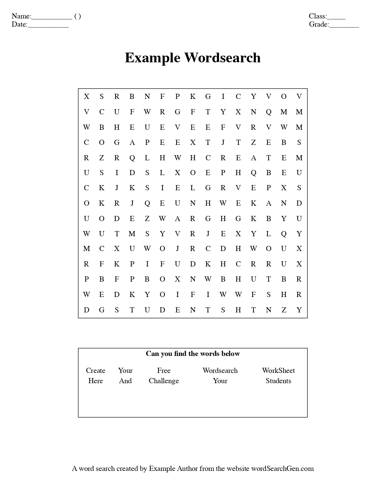
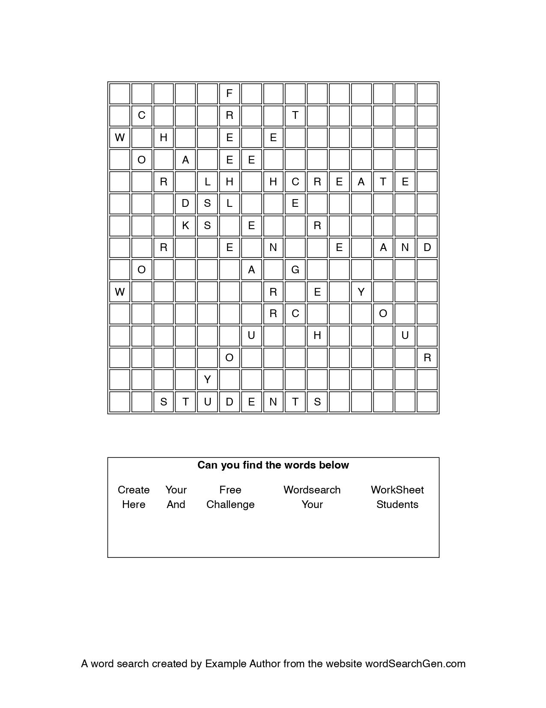
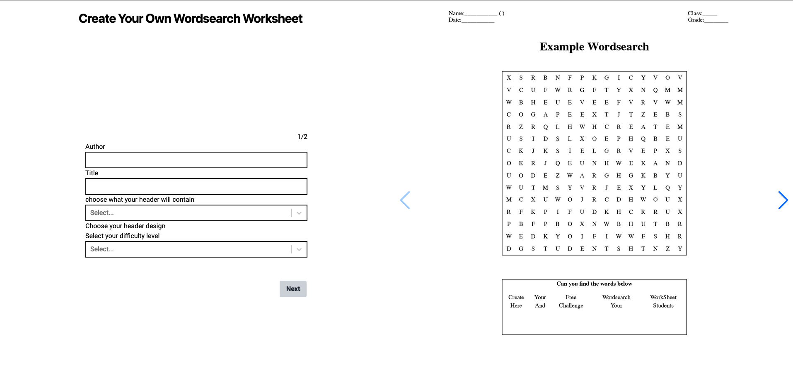

# Word search Worksheet Generator

> Live demo [Live Version Here](https://wordsearch-frontend.onrender.com/). <!-- If you have the project hosted somewhere, include the link here. -->

## Table of Contents

- [General Info](#general-information)
- [Technologies Used](#technologies-used)
- [Features](#features)
- [Screenshots](#screenshots)
- [Setup](#setup)
- [Usage](#usage)
- [Project Status](#project-status)
- [Room for Improvement](#room-for-improvement)
- [Acknowledgements](#acknowledgements)
- [Contact](#contact)
<!-- * [License](#license) -->

## General Information

A simple word search generator that allows teachers to add a selection of words, choose a certain difficulty (size of word search) and generate a worksheet with different headings such as space for students to write their name, the date etc.

The project allows teachers to create word searchs quickly and with a range of information headers they may want their students to fill in. It also provides an answer sheet for teachers to be able to use to quickly mark or provide answers for students as needed.

I undertook this project namely to provide myself a tool to quickly make a word search worksheet to meet a certain format so I can quickly create worksheets for my future teaching if needed. Additionally, I wanted to learn Typescript in a practical manner so as to advance my programming skills and knowledge.

## Technologies Used

- Typescript
- React JS
- Puppeteer
- Tailwind
- Jest
- Axios
- React Hook Forms
- Swiper JS
- Vite TS

## Features

List the ready features here:

- Allows users to choose from a set of header options suited to their needs.
- Lets users choose a difficulty setting based on word search size.
- Creates a downloadable word search PDF and corresponding answer sheet.

## Screenshots

#### Example word search



#### Example Answer Sheet



#### App UI



## Setup

To see this project in action visit the [demosite](https://wordsearch-frontend.onrender.com/)

To run this project locally you will need to either both this frontend repo and the [backend](https://github.com/zach7815/wordsearch-backend) repo. Or clone the fullstack repo that contains both the client and [fullstack repo](https://github.com/zach7815/wordSearchGenerator/) (please note the full stack repo doesn't receive the latest prod updates).

### For this repo

From the command line, git clone the repo. Alternatively, use Githubs GUI or other Git tools.

```
git clone https://github.com/zach7815/wordsearch-frontend.git
```

Next ensure you are within the client directory

```
cd client
```

If you haven't already, ensure you install TypeScript. The following command installs TypeScript globally on your computer.

```
npm install -g typescript
```

Next ensure you are still in the client Directory and run the installation command:

```
npm install
```

Then to run the project run the command:

```
npm run dev
```

please note for the frontend you will need to change the api that is currently being targeted.

In the frontend in `app.tsx` you will need to change:

```
https://wordsearch-backend.onrender.com/api/WordsearchData

to

http://localhost:3000
```

## Project Status

Project is: _in progress_

## Room for Improvement

Include areas you believe need improvement / could be improved. Also add TODOs for future development.

Room for improvement:

- The project is currently not mobile responsive, namely to the nature of the app and the users most likely only to use desktops when needing to create word searchs, though making it mobile responsive would allow worksheet creation on the go.

- Currently, the example word search shows all headers being used. An improvement would be to change example word search with different headers, sizes to match the users current chosen options or create some form of live preview.

To do:

- Adding Interactive word search that uses same info as word search worksheet.
- Add options to allow users to choose/exclude certain directions e.g [horizontal-left-write, vertical-top-to-bottom, diagonal-top-left-to-bottom-write]

## Contact

Created by [Zach Kozlowski-Best](https://zachkb.dev/) - feel free to contact me!

<!-- Optional -->
<!-- ## License -->
<!-- This project is open source and available under the [... License](). -->

<!-- You don't have to include all sections - just the one's relevant to your project -->
